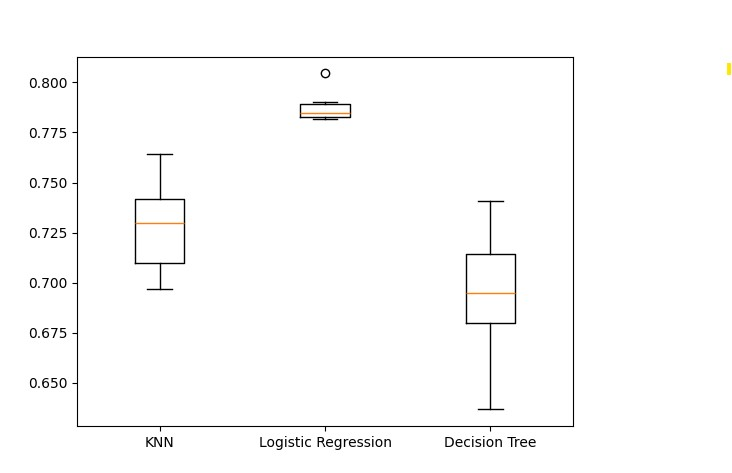

# Kaggle Fitness Classification Dataset Project

 This codebase is a nothing more than a learning exercise that uses Kaggle.com
 Fitness Classification dataset to evaluate various machine learning models.

 This codebase is not meant for any sort of production use.

This is a learning project to both complete the task and create template of things that should be done
when working on projects like this and a reference to exactly how I did it.

This project is based on the DataCamp Supervised Learning with Scikit-Learn class

* https://app.datacamp.com/learn/courses/supervised-learning-with-scikit-learn

It uses the Kaggle.com Fitness Classification Dataset (Synthetic)

* https://www.kaggle.com/datasets/muhammedderric/fitness-classification-dataset-synthetic/

Finally, it's also based on my knowledge and intuition from working in IT over the years.

---

## License

 Copyright 2025 - David C. Brown

 Licensed under the Apache License, Version 2.0 (the "License");
 you may not use this file except in compliance with the License.

 You may obtain a copy of the License at

    http://www.apache.org/licenses/LICENSE-2.0

 Unless required by applicable law or agreed to in writing, software
 distributed under the License is distributed on an "AS IS" BASIS,
 WITHOUT WARRANTIES OR CONDITIONS OF ANY KIND, either express or implied.
 See the License for the specific language governing permissions and
 limitations under the License.

---

## Obtaining the Kaggle Dataset for this project.

To obtain the dataset that this project was created to use.  It can be found
at kaggle.com.

https://www.kaggle.com/datasets/muhammedderric/fitness-classification-dataset-synthetic

Extract the files to the Dataset subdirectory: git_repo_root/Fitness_Classification_Dataset/Dataset

---

## Notes About Implementation

### Dataset and Notes

There is a directory for the Dataset, but the .gitignore file ignores files so they aren't include
in this git repository as they belong to Kaggle or someone else, so I will not distribute them.

I also have very highly documented DataCamp course notes, but due to how detailed those documents
are and the information they include.  I will not distribute those either.

### Models Evaluated

Currently, this implementation evaluates **KNeighborsClassification (KNN), LogisticRegression, and 
DecisionTreeClassifier**.  This is primarily due to it was part of the DataCamp course I took and
was trying to create a real (full code / non-Jupyter Notebook) version and document that journey
as I have here.

### See Other Considerations

During this process I learned new things that didn't get implemented,
I recommend reviewing the Other Considerations section below.

### Evaluation Results and Boxplot

| **Model**            | **Accuracy**       | **Standard Deviation** |
|----------------------|--------------------|------------------------|
| KNeighborsClassifier | 0.7281100691804417 | 0.023148268641160034   |
| Logistic Regression  | 0.7881313771319686 | 0.007863978663974737   |
| Decision Tree        | 0.6937944111214366 | 0.03283302412325484    |

**Model Evaluation Boxplat**

 

---

## Outline of Steps Taking

This is primarily an outline of the steps take to maintain a reference of what was done.  It may
not be the best solution, but it is the one I used in the learning process based on the class taken 
and the dataset used.

* Review the data
  * Determine any missing data.
  * Determine any categorical that may need to be addressed.
  * Determine any inconsistencies in values that may need to be normalized.
  * Determine if there are any necessary features that can be removed.
  * Determine if there are any features that can be added crafted out of existing data.
  * Evaluate the need to scale the data.
  * Document limitations of your dataset.
    * Size limitations
    * Feature limitations
    * Ability to create useful synthetic features from existing features.
* Determine Model Selection
  * Review Best Practices for Selecting a Classification Model (web search / ask AI)
  * Determine and document model preferred scoring method.
  * Select one or more models
    * Evaluate the pros and cons of each model compared to your dataset limitations. 
    * If evaluating multiple models, consider using Pipelines to automate the task.
      * Requires common API for each model to use with pipeline loops.
* Splitting the Data
  * Data should be split before you clean up the data to prevent data leakage.
  * Based on your steps above, determine what you believe to be the idea split of training vs testing data.
  * Write the code to split the data appropriately.
    * Evaluate the resulting dataset splits.
* Preparing the Dataset
  * Create any synthetic features determine earlier.
  * Cleaning the Dataset
    * Using the information and requirements from the above steps.
      * Create a plan to address any issues with the dataset.
      * Evaluate that those changes will address any requirements for your model selection(s).
    * Begin coding your solution to clean the data.
      * Evaluate the resulting datasets to ensure they still meet your requirements.
* Prepare for Model Evaluation
  * If evaluating a single model, write code for it.
  * If evaluating multiple modes, utilize loops and / or pipelines for efficiency where possible.
* Execute Evaluation
  * Review Results

---

## Other Considerations

### Scaling Prior to Each KFold Iteration

It's my understanding that when you are doing cross-validation with KFold.  It is better to 
performs the scaling each iteration to prevent data leakage and when transformed, it utilizes
statistics only for the subset being validated during the iteration.

The code here does not utilize this, but may in the future.

### Code Layout and Iteration Considerations

I was thinking about if I was performing this process for a real-world situation and how I 
would go about structuring the project.  I can see where I might have several code iterations
while trying to improve my results.  While git can track code changes, I may also need side-by-side
evaluations or even need to reuse a specific code that maybe model or process dependent.

I haven't fully thought this through, but I have no doubt that there are many engineers who have
run into this and likely have unique or beautiful solutions.  The proper project structure can 
be very important for efficiency reasons.

Possibly creating modules for the different aspects of this process and submodules for the 
deviation of those requirements.